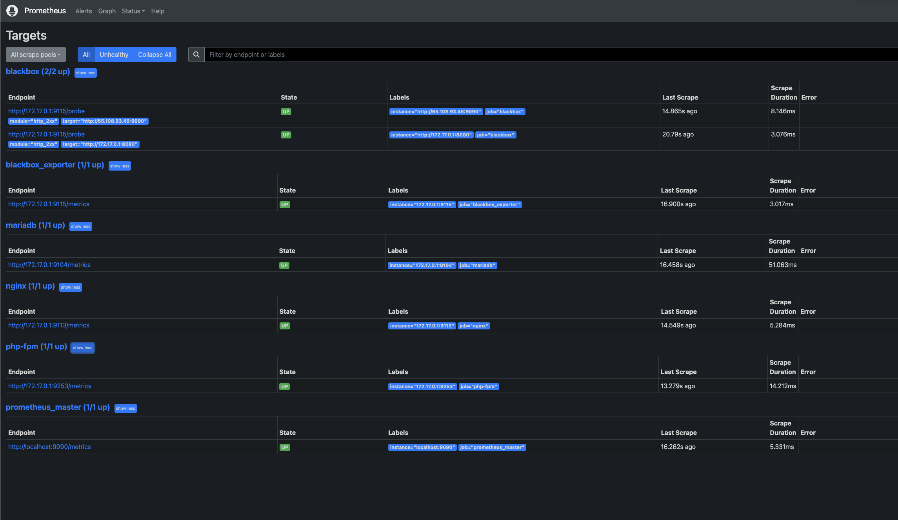
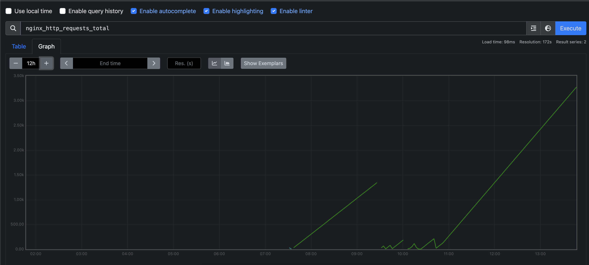
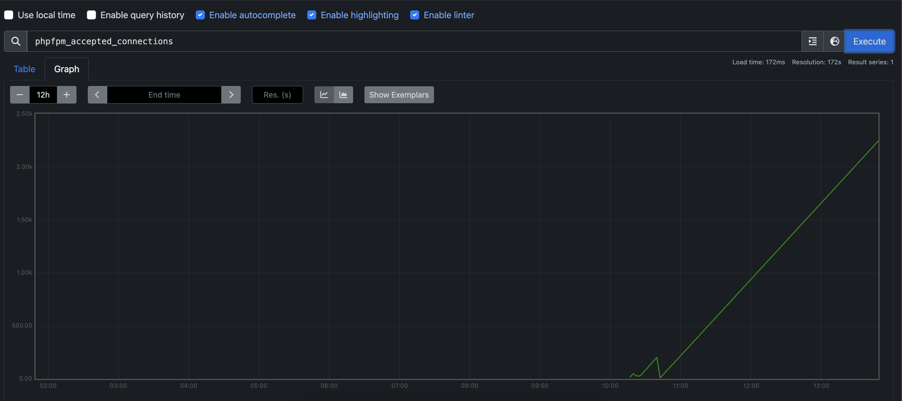
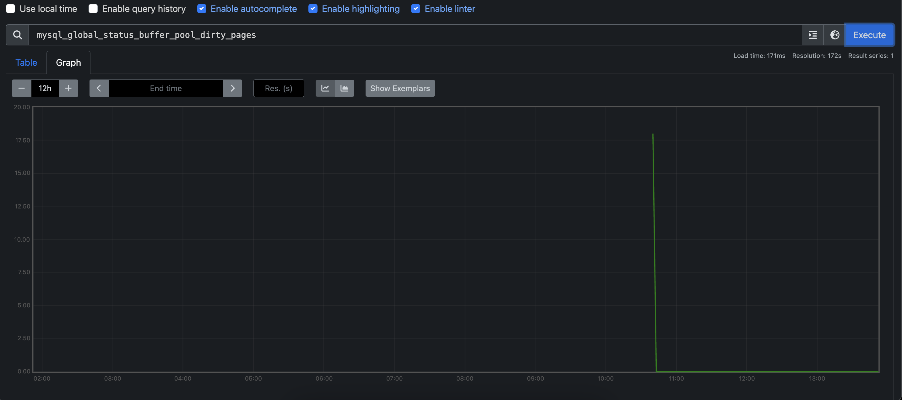
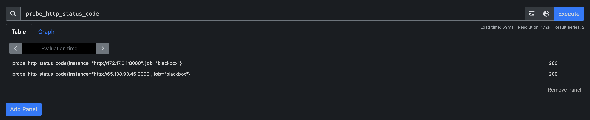

# ДЗ №1

1) Развернул prometheus согласно инструкции, предоставленной в лекции
2) В качестве CMS развернул WordPress в docker compose (приложил файл с композом)
CMS включает в себя nginx, php-fpm и mariadb
3) Развернул необходимые экспортеры в докере:

```shell
# mysqld exporter
docker run --rm -d -p 172.17.0.1:9104:9104 -e MYSQLD_EXPORTER_PASSWORD=pass prom/mysqld-exporter --mysqld.address=172.17.0.1:3306 --mysqld.username=exporter

# php-fpm exporter
docker run --rm -d -p 172.17.0.1:9253:9253 -it --rm -e PHP_FPM_SCRAPE_URI="tcp://172.17.0.1:9000/status" hipages/php-fpm_exporter

# nginx exporter
docker run --rm -p 172.17.0.1:9113:9113 -d nginx/nginx-prometheus-exporter:1.1.0 --nginx.scrape-uri=http://172.17.0.1:9145/basic_status

# blackbox exporter. Файл конфигурации blackbox.yml взят из оф. репозитория
docker run -d --rm  -p 172.17.0.1:9115:9115/tcp --name blackbox_exporter -v $(pwd):/config  quay.io/prometheus/blackbox-exporter:latest --config.file=/config/blackbox.yml
```
4) Сконфигурировал прометей на сбор метрик со всех экспортеров


1) Скриншоты:

Таргеты прометея:


Метрика nginx:


Метрика php-fpm:


Метрика mysql:


Метрика blackbox exporter на проверку доступности WordPress и веба прометея:

